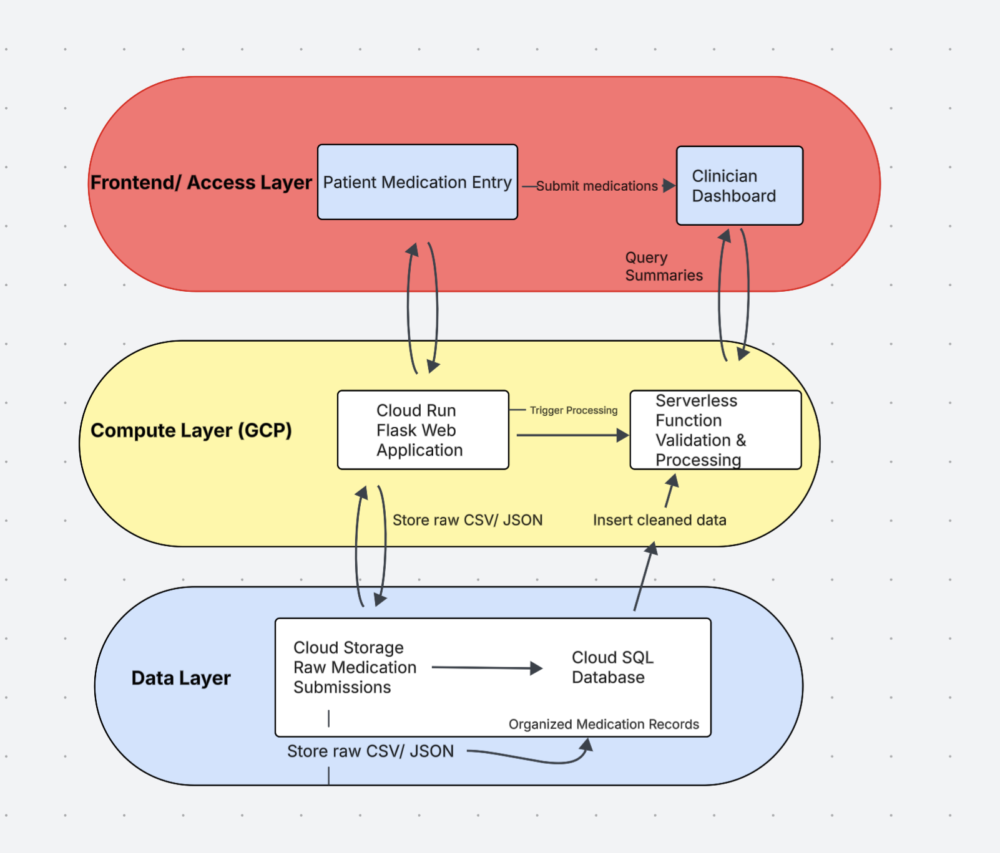
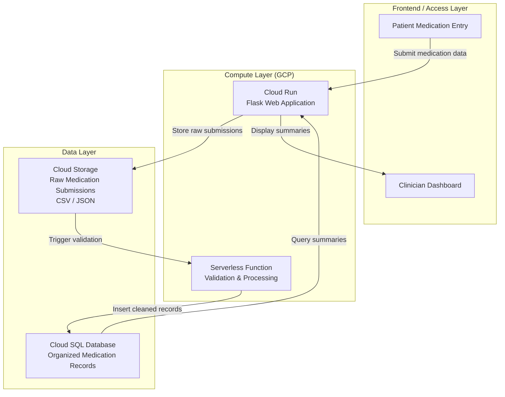

# Architecture and Implementation Plan
This document describes the high level cloud architecture for the Medication Understanding and Reconciliation Support Tool and explains how cloud services are used together to support the system.

## Architecture Diagram

## Service Mapping 

| Layer | Cloud Service | Role in Solution | Related Assignment or Module |
|------|---------------|------------------|------------------------------|
| Frontend / Access | Flask Web Application | Provides an interface for patients and clinic staff to submit medication information and for clinicians to view summaries | Web application / API module |
| Storage | Cloud Storage | Stores raw medication submissions such as CSV files for traceability | Cloud storage assignment |
| Compute | Serverless Function | Validates and processes submitted medication data | Serverless computing module |
| Database | Managed SQL Database | Stores cleaned and organized medication records for querying and reporting | SQL and database module |

## Data Flow Narrative 
1. A patient or clinic staff member submits medication information through the Flask web application.
2. The web application stores the raw medication submission in cloud storage for record keeping.
3. A serverless function is triggered to check the file format and ensure required fields are present.
4. Invalid or incomplete entries are flagged for review, while valid data continues through processing.
5. Valid medication records are inserted into the managed SQL database.
6. The system organizes medications by condition and prepares a clear summary for review.
7. Clinicians access the summarized medication view through the web application to support medication reconciliation during visits.

 
## Security, Identity, and Governance
This system uses synthetic medication data and does not store real patient identifiers to avoid handling protected health information. Access to cloud resources is managed using role based access controls to ensure that only authorized services can read or write data. Data is used only for demonstration and educational purposes, and no real patient information is entered into the system. This approach helps reduce privacy risk while still allowing the system to function as a realistic healthcare workflow.

Application credentials are managed using environment variables or cloud managed identity services rather than being hardcoded in the application. Raw data stored in cloud storage and structured data stored in the database are kept private and are not publicly accessible. Clinical decision making remains the responsibility of licensed providers, and the system is intended only to support patient education and medication reconciliation.

## Cost and Operational Considerations

The primary cost drivers in this architecture are compute services and the managed SQL database. Compute costs arise from running the Flask application and any background processing functions. On the other hand, database costs are associated with storing and querying organized medication records. Storage costs are expected to be relatively low, as medication lists and related metadata are small in size and do not require large volumes of long-term storage. No custom AI model training is included, which avoids additional costs associated with machine learning workloads.

To control costs, the design relies on serverless and managed services rather than always-on virtual machines. The Flask web application is designed in a way that does not require to be active at all times. Background processing tasks only run when new medication data is submitted, which helps reduce uncecessary resource usage.  This avoids paying for idle compute resources. To remain within a student budget or free tier, the system uses minimal database instance sizes, limits data retention for raw uploads, and processes data on demand or on a scheduled basis rather than continuously.

